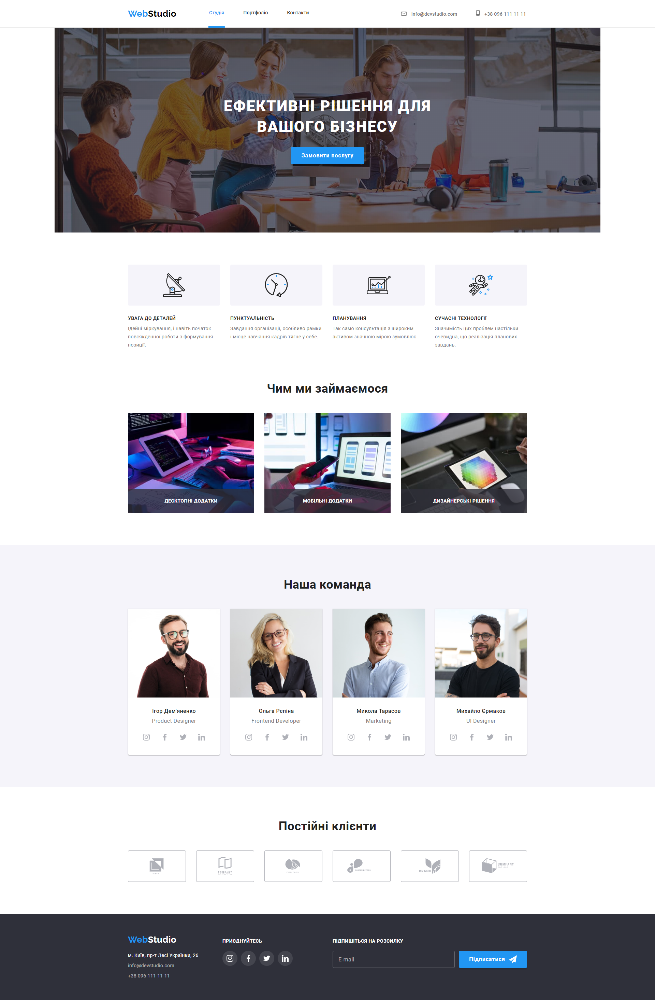
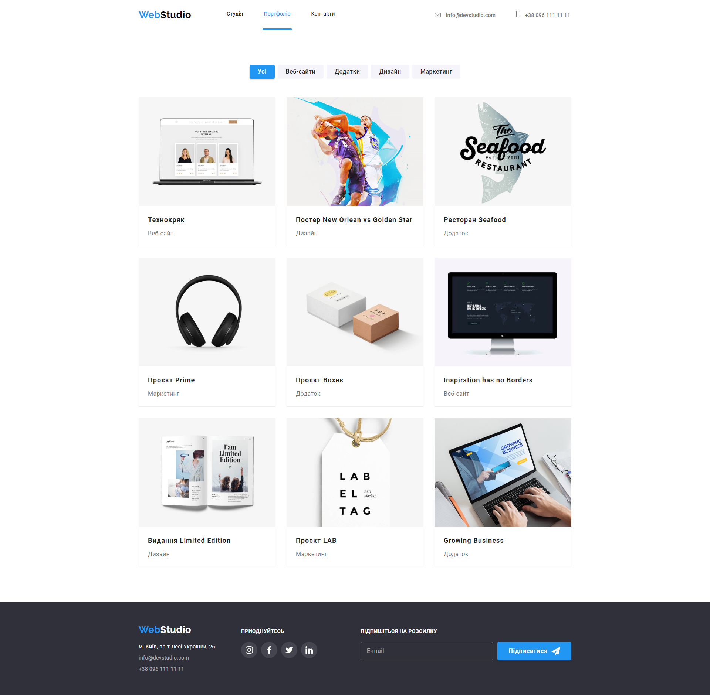

# WebStudio website

## Homework#07

The HTML code of the
[project](https://github.com/Valerii2022/goit-markup-hw-06-FSON/blob/main/index.html) was refactored
using the BEM methodology. The CSS code of the
[project](https://github.com/Valerii2022/goit-markup-hw-06-FSON/blob/main/css/style.css) was
refactored using the SASS preprocessor. Configured GitHub Pages and added a
[link](https://valerii2022.github.io/goit-markup-hw-07-FSON/) to the live page in the
GitHub-repository header.

### [Main Page](https://valerii2022.github.io/goit-markup-hw-07-FSON/)

### [Portfolio Page](https://valerii2022.github.io/goit-markup-hw-07-FSON/portfolio.html)

